<div>
<a href="https://angelip2303.github.io" class="font-300">Ángel Iglesias Préstamo</a>
</div>

<div>
  	<h1 class="font-extrabold">PSchema</h1>
  	<p class="font-300">
      Analysis and implementation of an algorithm to validate Knowledge Graphs using Big data techniques
    </p>
</div>

<Pagination classNames="text-gray-300" />

---

# 🗂️ Table of contents

1. [Project in a nutshell](3)
2. [Motivation](4)
    1. [Knowledge Graphs](5)
    2. [To put it into context...](7)
    3. [Wikidata](8)
    4. [How do we address that?](9)
3. [The algorithm in a nutshell](10)
    1. [Pregel](11)
    2. [PSchema](13)
    3. [How are Shape Expressions represented?](14)
    4. [Reverse Level order traversal](15)
    5. [The algorithm in action](16)
    6. [Resulting subgraph](26)
    7. [Theorem](27)
4. [Optimizations](28)
    1. [How is the dataset stored?](29)
    2. [Move-to-Front coding and Caching](30)
5. [Diffusion](31)
    1. [Results](32)
    2. [BioHackathon 2023](34)
    3. [Applications and Future Work](35)

<style>
ul {
    padding: 0;
    margin: 0;
}
li {
    font-size: 0.7rem;
}
</style>

---

# 🐿️ The project in a nutshell

<br />

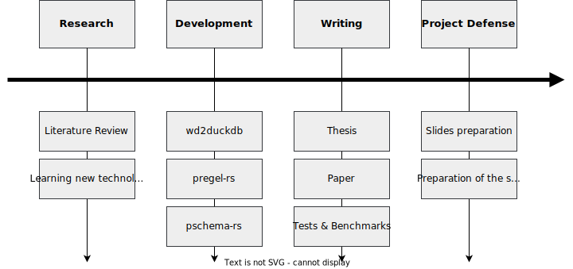

---
layout: section
---

# 🥁 Motivation

---

# 🧠 Knowledge Graphs

<figure>
    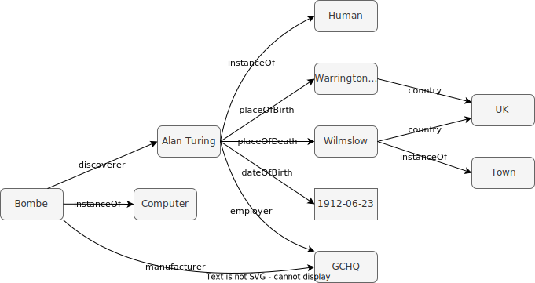
    <figcaption> <span> Figure 1: </span> Knowledge Graph modelling some information about Alan Turing </figcaption>
</figure>

---
layout: intro-image
image: assets/img/kg.png
---

---
layout: center
---

# 🌉 To put it in context...

- ✔ Knowledge Graphs are a **powerful tool** to represent knowledge.
- ✔ They are **flexible** and **extensible**.
- ✔ They are **easy to understand** by humans.
- ✔ They are used in **many fields**.
- ❌ They are **hard to be validated** by machines.
- ❌ They tend to be **huge**.

---
layout: center
---

# 🌐 Wikidata

- ✔ Is a **free** and **open** Knowledge Graph.
- ✔ Supports **multiple languages**, thanks to _opaque URIs_.
- ✔ Supports **Shape Expressions** since 2019.
- ❌ Is **huge**<sup>1</sup>.
- ❌ Is **hard to validate**, due to its size.
- ❌ Data comes from **multiple sources**.

<Footnotes separator>
    <Footnote :number=1>
    Wikidata contains more than <a href="https://www.wikidata.org/wiki/Wikidata:Statistics"> 100 million items</a>. The dump file is 100 GB compressed, and 1.5 TB uncompressed.
    </Footnote>
</Footnotes>

---

# 🤓 How do we address that?

<figure>
    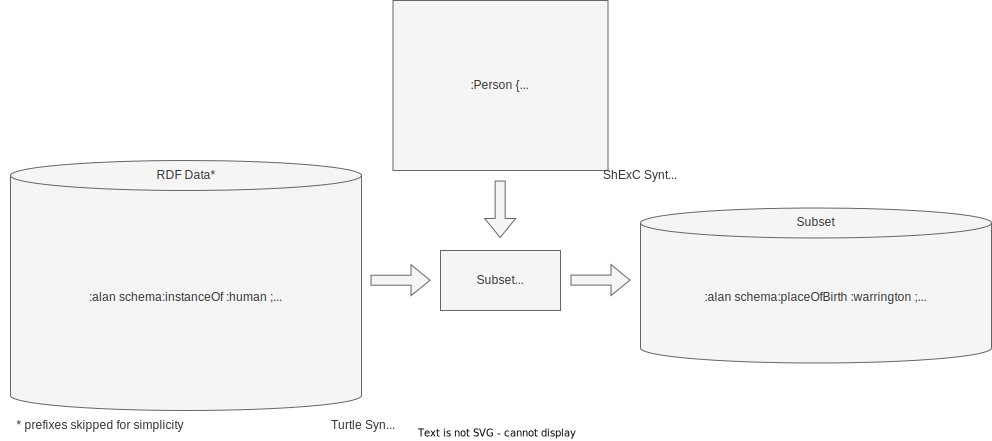
    <figcaption> <span> Figure 2: </span> ShEx-based <it> subset </it> generation process for Alan Turing's example </figcaption>
</figure>

---
layout: section
---

# 🔍 The algorithm in a nutshell

---
layout: diagram
---

<h1> 👨‍💻 Pregel<sup>1</sup> </h1>

- Graph processing framework.
- Developed by Google.
- Based on Bulk Synchronous Parallel model.
- Uses message passing.
- Distributed.
- _Thinking like a vertex_.

<div class="flex flex-row gap-4">
    <figure>
        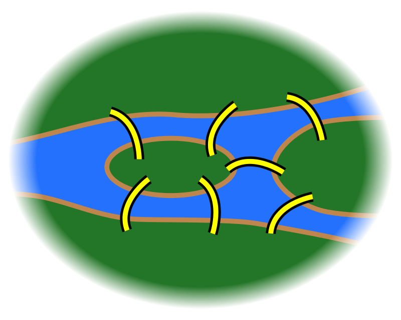
        <figcaption> <span> Figure 1: </span> Abstract representation of the Königsberg bridges problem </figcaption>
    </figure>
    <figure>
        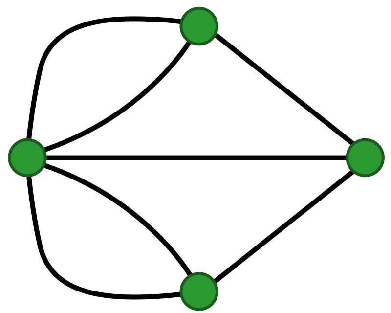
        <figcaption> <span> Figure 2: </span> Graph representation of the problem  </figcaption>
    </figure>
</div>

<Footnotes separator>
    <Footnote :number=1>
    Pregel as implemented in <a href="https://github.com/angelip2303/pregel-rs"> pregel-rs </a>
    </Footnote>
</Footnotes>

::right::

<figure>
    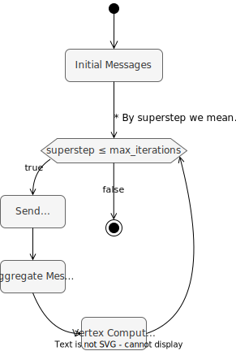
    <figcaption> <span> Figure 3: </span> Pregel model </figcaption>
</figure>

---
layout: quote
---

## "Do not communicate by sharing memory; instead, share memory by communicating."
[Effective Go](https://go.dev/doc/effective_go#concurrency)

---
layout: two-cols-unbalanced
---

# 🧮 PSchema

- **P**regel-based **Schema** validation algorithm.
- **Validates** Knowledge Graphs.
- Based on a **multithreaded** Pregel.
- Makes use of **Shape Expressions**.
- Can validate different **Knowledge Graphs**.

## 💭 Alternatives

- [wdsub](https://github.com/weso/wdsub)
- [wdumper](https://github.com/bennofs/wdumper)
- [sparkwdsub](https://github.com/weso/sparkwdsub)

::right::


---
layout: diagram-header
---

# 🤔 How are Shape Expressions represented?

::left::

- A Shape Expression is represented as a 🌳.
- Each node represents a **Shape**.
- **Validation** is done by traversing the tree.
- They are implemented according to their **behavior**.

The following is an example of a Shape Expression:

```turtle
:Person {
	:placeOfBirth @:Place ;
	:dateOfBirth @:Date ;
	:employer @:Organization ;
}
:Place {
	:country @:Country
}
:Country {}
:Organization {}
:Date {}
```

::right::

<figure>
    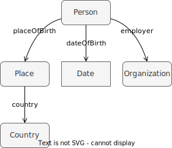
    <figcaption> <span> Figure 4: </span> Shape Expression tree </figcaption>
</figure>

---
layout: diagram-header
---

# 🚶 _Reverse_ Level order traversal

::left::

- **Level order traversal** visits the nodes of a tree level by level, same as _breadth-first search_.
- **_Reverse_ level order traversal** visits the nodes of a tree level by level, but in _reverse_ order.
- Is used to traverse the **Shape Expression tree**.
- For each _superstep_ of the Pregel, the algorithm traverses **one** level of the tree.

<Footnotes separator>
    <Footnote :number=1>
    <it> Reverse </it> level order traversal as implemented in <a href="https://github.com/angelip2303/pschema-rs"> pschema-rs </a>
    </Footnote>
</Footnotes>

::right::

<figure>
    
    <figcaption> <span> Order: </span> h, i, j, k, d, e, f, g, b, c, a  </figcaption>
</figure>

<style>
li {
    padding-bottom: 0.5em;
}
</style>

---

# 0️⃣ The algorithm in action -- Initial Messages

<figure>
    
    <figcaption> <span> Figure 5: </span> The Initial Messages are sent to all the nodes in the graph </figcaption>
</figure>

---
layout: big-diagram
---

# 1️⃣ 1<sup>st</sup> superstep -- Send Messages

::big::


::small::

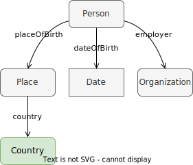

::bottom::

<Footnotes separator>
    <Footnote :number=1>
        For simplicity, only the nodes that are valid are highlighted. However, all the nodes will send messages to their neighbors in the <it> destination </it> to <it> source </it> direction.
    </Footnote>
</Footnotes>

---
layout: big-diagram
---

# 1️⃣ 1<sup>st</sup> superstep -- Aggregate Messages

::big::


::small::


---
layout: big-diagram
---

# 1️⃣ 1<sup>st</sup> superstep -- Vertex Program

::big::


::small::


---
layout: big-diagram
---

# 2️⃣ 2<sup>nd</sup> superstep -- Send Messages

::big::


::small::

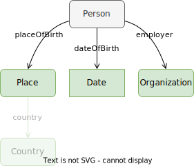

---
layout: big-diagram
---

# 2️⃣ 2<sup>nd</sup> superstep -- Aggregate Messages

::big::


::small::


---
layout: big-diagram
---

# 2️⃣ 2<sup>nd</sup> superstep -- Vertex Program

::big::


::small::


---
layout: big-diagram
---

# 3️⃣ 3<sup>rd</sup> superstep -- Send Messages

::big::


::small::

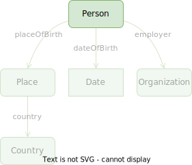

::bottom::

<Footnotes separator>
    <Footnote :number=1>
        In the actual implementation, the message is sent by the <it> first </it> node in the DataFrame.
    </Footnote>
</Footnotes>

---
layout: big-diagram
---

# 3️⃣ 3<sup>rd</sup> superstep -- Aggregate Messages

::big::


::small::


---
layout: big-diagram
---

# 3️⃣ 3<sup>rd</sup> superstep -- Vertex Program

::big::


::small::


---

# 🏁 Resulting _subgraph_

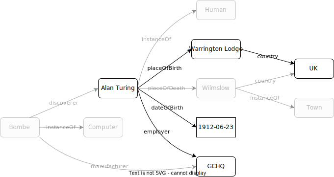

---
layout: quote
---

<h2> 🎓 Theorem. Convergence of the PSchema algorithm. </h2> 

<h4 class="mt-2">
Given a Shape Expression tree <em>𝐓</em> and a
Knowledge Graph <em>𝐆</em>, let <em>𝒉</em> denote the height of <em>𝐆</em>; then the PSchema algorithm is going to converge
in <em>𝒉</em> supersteps. This is, the algorithm is going to validate all the Shapes of <em>𝐓</em> in <em>𝒉</em> supersteps.
</h4>

<style>
@import url('https://fonts.googleapis.com/css2?family=Noto+Sans+Math&display=swap');
em {
    font-family: 'Noto Sans Math', sans-serif;
    font-style: normal;
    font-weight: 400;
}
</style>

---
layout: section
---

# 🚀 Optimizations

---
layout: two-cols-bottom
---

# 🗃️ How is the dataset stored?

::left::

<h2> 📦 Row-oriented </h2>

- Each **row** contains _heterogeneous_ data (i.e JSON).
- **Row storage** is good for _transactional_ workloads.
- JSON (i.e. Wikidata) introduces **boilerplate**.

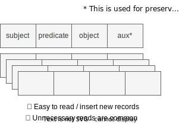

::right::

<h2> 📦 Column-oriented<sup>1</sup> </h2>

- Each **column** contains _homogeneous_ data.
- **Columnar storage** is good for _analytical_ workloads.
- DuckDB is a column-oriented database.

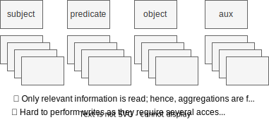

This allows us to implement some **optimizations**...

::bottom::

<Footnotes separator>
    <Footnote :number=1>
    <a href="https://github.com/angelip2303/wd2duckdb"> wd2duckdb </a> aims for giving support to the column-oriented database DuckDB for storing Wikidata dumps.
    </Footnote>
</Footnotes>


---
layout: two-cols-bottom
---

# 🔁 Move-to-Front Coding and Caching

::left::

The **Move-to-Front Coding** is a **lossless** _transformation algorithm_ which processes a sequence of symbols and produces a sequence of integers.

The **idea** is that the most recently used symbols are more likely to be used again in the near future. Hence, we can maintain a list of the symbols and when one is used, it is moved to the front of the list.

1. This allows us to **exploit the locality** of the data.
2. The **most frequent** items will require **fewer bits**.
3. **Cache** misses are **less likely** to happen.

⚠ `Integers` _usually_ require **less bytes** to be stored than `Strings`, so more data can be cached.

<style>
.slidev-layout ol {
    list-style: none;
    padding: 0;
    margin: 0;
}   

ol li {
    padding-left: 1rem;
    text-indent: -0.75rem;
}

ol li::before {
    content: "😲 ";
}

ol li:nth-child(2)::before {
    content: '🤏 ';
}

ol li:nth-child(3)::before {
    content: '😎 ';
}
</style>

::right::

#### i.e Encoding<sup>1</sup> the string _panama_

| **input** |  **output**  | **list**                   |
|-----------|--------------|----------------------------|
| p         | 15           | abcdefghijklmnopqrstuvwxyz |
| a         | 15 1         | pabcdefghijklmnoqrstuvwxyz |
| n         | 15 1 14      | apbcdefghijklmnoqrstuvwxyz |
| a         | 15 1 14 1    | napbcdefghijklmoqrstuvwxyz |
| m         | 15 1 14 1 14 | anpbcdefghijklmoqrstuvwxyz |
| a         | 15 1 14 1 14 | manpbcdefghijkloqrstuvwxyz |

<style>
h4 {
    margin-left: 1em;
}
table {
    margin-left: 1em;
}
</style>

::bottom::

<Footnotes separator>
    <Footnote :number=1>
        <a href="https://www.geeksforgeeks.org/move-front-data-transform-algorithm/"> https://www.geeksforgeeks.org/move-front-data-transform-algorithm/ </a>
    </Footnote>
</Footnotes>

<style>
ul li::before {
    content: "";
}
</style>

---
layout: section
---

# 📢 Diffusion

---

# 📊 Results

<br />

## 👎 No optimization enabled

|   Shape Expression   | Initial triples | Resulting triples | Time (s) | Memory (GB) |
|:--------------------:|:---------------:|:-----------------:|:--------:|:-----------:|
| `protein`              | 7,346,129       | 226,241           | 23.35    | 6.74        |
| `subcellular_location` | 7,346,129       | 1,084,151         | 57.56    | 6.04        |

## 👍 All optimizations enabled

|   Shape Expression   | Initial triples | Resulting triples | Time (s) | Memory (GB) |
|:--------------------:|:---------------:|:-----------------:|:--------:|:-----------:|
| `protein`              | 7,346,129       | 226,241           | 14.58    | 3.87        |
| `subcellular_location` | 7,346,129       | 1,084,151         | 37.76    | 3.75        |


---
layout: three-images
---

::left::

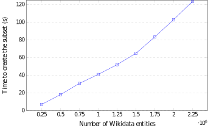

::top::

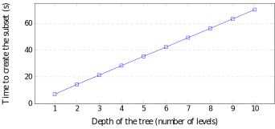

::bottom::

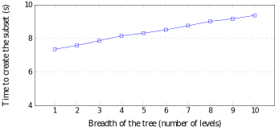

---
layout: iframe-right
url: https://biohackrxiv.org/md73k
---

# 🧬 BioHackathon 2023

- **The Japan BioHackathon** is a series of hackathons organized by the [DBCLS](https://dbcls.rois.ac.jp/en/) since 2008.
- The **goal** is to promote **collaboration** and **development** of **open-source** software, **standards** and **databases** in the life sciences.
- This was my **first contribution** to the scientific community, which was published in [BioHackrXiv](https://biohackrxiv.org/md73k) and [Zenodo](https://zenodo.org/record/8086938).

<style>
li {
    padding-bottom: 0.5em;
}
</style>

---
layout: center
---

# 🔮 Applications and Future Work

- 🔍 Semantic Search Engine
- 🔗 Data Integration
- 💻 Processing large datasets in computers with limited resources

---
layout: end
---

---
layout: cover
---

<figure>
    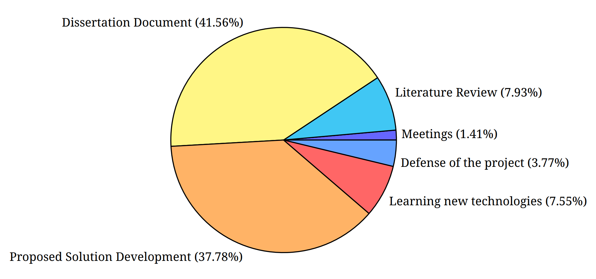
    <figcaption> <span> Figure 1: </span> Time spent in each phase of the project </figcaption>
</figure>

---
layout: two-cols-content-bottom
---

# 👨‍🏫 How do we represent Knowledge?

::content::

- _Knowledge_ is at the highest level of abstraction, while _Data_ is at the lowest.
- We want to represent _Knowledge_ using _Data_. **How do we do that?**

::left::

## 📄 RDF

- **R**esource **D**escription **F**ramework.
- W3C Recommendation.
- Standard for knowledge representation.
- Based on triples.
- Uses URIs to identify resources.

::right::

## 🕶️ Opaque URIs

- A URI is a unique sequence of characters that **identifies** a resource, namely, _subjects_, _predicates_ and _objects_.
- Designing good URIs is the **first step** in linked data development.

::bottom::

```turtle
# i.e. Alan Turing is a Human
# N-Triples: subject predicate object .
<http://example.org/alan> <http://example.org/instanceOf> <http://example.org/Human> . # descriptive
<http://example.org/Q7251> <http://example.org/P31> <http://example.org/Q5> . # opaque
```

---
layout: two-cols-bottom
---

# 💡 Other examples of Knowledge Graphs

::left::

## 👨‍⚕️ Uniprot<sup>1</sup>

- It is a **centralized** database of protein sequences and functions, created in 2002.
- Most of the data is obtained from sequencing projects and from the scientific literature.
- There are **more than 200 million** protein sequences.

::right::

## 🧪 PubChem<sup>2</sup>

- It is a **decentralized** database of chemical molecules and their biological activities.
- It is a **collection of databases** maintained by the National Center for Biotechnology Information (NCBI).
- There are **more than 100 million** chemical compounds and **more than 300 million** substances.
- Information is obtained from scientific literature and from other databases, having **more than 900 sources**.

::bottom::

<Footnotes separator>
    <Footnote :number=1>
        <a href="https://www.uniprot.org/"> https://www.uniprot.org/ </a>
    </Footnote>
        <Footnote :number=2>
    <a href="https://pubchem.ncbi.nlm.nih.gov/"> https://pubchem.ncbi.nlm.nih.gov/ </a>
    </Footnote>
</Footnotes>

---
layout: center
---

# 💁‍♂️ Supported Shape Expression features

| **Feature**                      | **Supported** | **PSchema Representation** |
|----------------------------------|:-------------:|--------|
| Triple constraints               | ✔ | TripleConstraint, ShapeAnd, ShapeOr |
| Cardinality                      | ✔ |    Cardinality      |
| Labels, descriptions and aliases | ❌ | ---  |
| Value sets                       | ✔ |     ShapeOr      |
| Built-in DataTypes               | ✔ | ShapeLiteral |
| Facets                           | ❌ | --- |
| Qualifiers                       | ❌ | --- |
| References                       | ✔ | ShapeReference |
| Ranks                            | ❌ | --- |
| SiteLinks                        | ❌ | --- |

---
layout: center
---

# 💾 Import and export formats

| **Feature** | **Supported** | **Comments** |
|-------|:-----------:|--------|
|    DuckDB Import | ✔ |     ---     |
|    DuckDB Export  | 🕒 | Even if it's planned, we are waiting for the `pola-rs` release |
|    Parquet Import  | ❌ |     ---     |
|    Parquet Export  | ✔ |     ---     |
|    NTriples Import  | ✔  |    ---      |
|    NTriples Export  | ✔ |     ---     |

---
layout: center
---

# 🔗 Links

- [wd2duckdb](https://github.com/angelip2303/wd2duckdb)
- [pregel-rs](https://github.com/angelip2303/pregel-rs)
- [pschema-rs](https://github.com/angelip2303/pschema-rs)