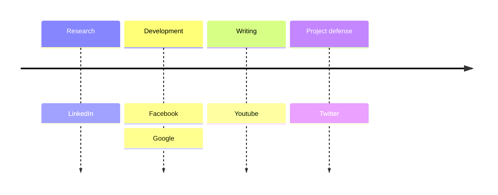
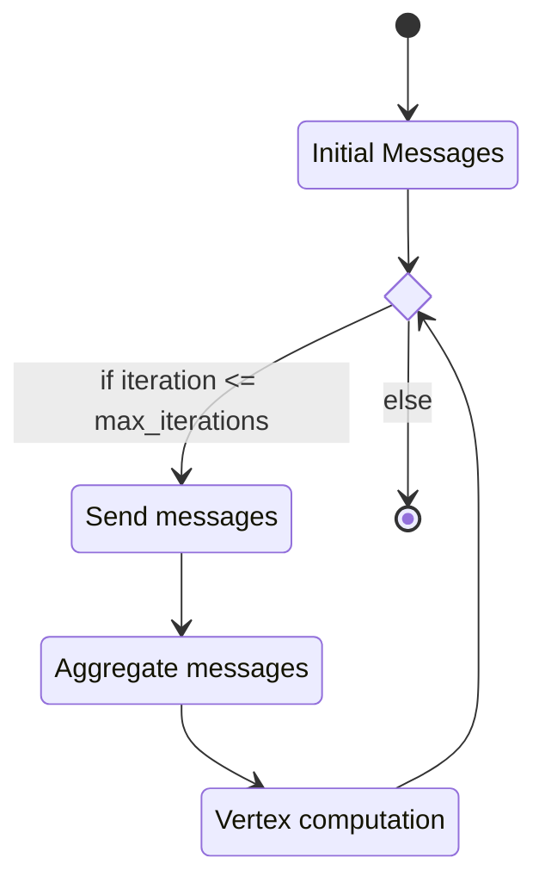
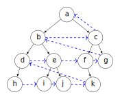
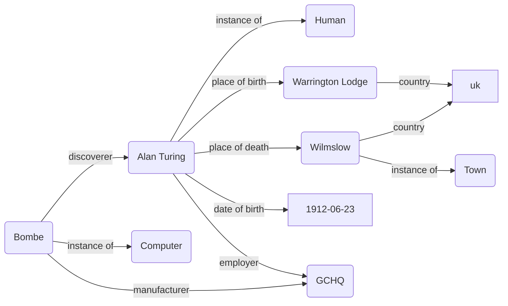

<div>
<a href="https://angelip2303.github.io" class="font-300">Ángel Iglesias Préstamo</a>
</div>

<div>
  	<h1 class="font-extrabold">PSchema</h1>
  	<p class="font-300">
      Analysis and implementation of an algorithm to validate Knowledge Graphs using Big data techniques
    </p>
</div>

---

# 🗂️ Table of contents

- [Introduction](#introduction)

---

# 🐿️ The project in a nutshell



---

# 🧠 Knowledge Graphs

A **Knowledge Graph** is a graph-based knowledge representation that captures knowledge as a set of entities and relationships between them.

i.e. _The Hunger Games is a dystopian novel_


---

# 👨‍🏫 How do we represent Knowledge?

- _Knowledge_ is at the highest level of abstraction
- _Data_ is the lowest level of abstraction
- We want to represent _Knowledge_ using _Data_
- We need a _Knowledge Representation Language_
- We need a _Knowledge Graph_

That's were RDF comes in

---

# 📄 RDF

- **R**esource **D**escription **F**ramework
- W3C Recommendation
- Standard for knowledge representation
- Based on triples
- Uses URIs to identify resources

```turtle
# i.e. The Hunger Games is a dystopian novel
# subject predicate object .
<http://example.org/thg> <http://example.org/isOfGenre> <http://example.org/dystopianNovel> .
```
---

# 🕶️ Opaque URIs

- A URI is a sequence of characters that identifies a resource.
- They are used to identify resources in RDF, namely, subjects, predicates and objects.
- Designing good URIs is the first step in linked data development.
- There are two main types of URIs: descriptive and opaque.

<div class="grid grid-cols-2">
    <div>
        <h3> Descriptive URIs </h3>
        <p> http://example.org/AlanTuring </p>
        <p> http://example.org/AlanTuring#person </p>
        <p> http://example.org/AlanTuring#human </p>
    </div>
    <div>
        <h3> Opaque URIs </h3>
        <p> http://example.org/1 </p>
        <p> http://example.org/2 </p>
        <p> http://example.org/3 </p>
    </div>
</div>

---
layout: center
---

# Big Data

-  📈 Volume
- 🚄 Velocity
- 🌪️ Variety

---
layout: diagram
---

<h1> 👨‍💻 Pregel<sup>1</sup> </h1>

- Graph processing framework
- Developed by Google
- Based on Bulk Synchronous Parallel model
- Uses message passing
- Distributed

<Footnotes separator>
    <Footnote :number=1>
    Pregel as implemented in <a href="https://github.com/angelip2303/pregel-rs"> pregel-rs </a>
    </Footnote>
</Footnotes>

::right::



---
layout: quote
---

## "Do not communicate by sharing memory; instead, share memory by communicating."
[Effective Go](https://go.dev/doc/effective_go#concurrency)

---
layout: diagram
---

# 🌳 Shape Expression tree

```turtle
:Person {
	:birthPlace @:Place ;
	:birthDate @:Date ;
	:employer @:Organization ;
}
:Place {
	:country @:Country
}
:Country {}
:Organization {}
:Date {}
```

::right::


---
layout: diagram-header
---

# 🚶 _Reverse_ Level order traversal

::left::

- **Level order traversal** visits the nodes of a tree level by level.
- **Reverse** level order traversal visits the nodes of a tree level by level, but in reverse order.


<Footnotes separator>
    <Footnote :number=1>
    <it> Reverse </it> level order traversal as implemented in <a href="https://github.com/angelip2303/pschema-rs"> pschema-rs </a>
    </Footnote>
</Footnotes>

::right::



<p> <span> Order: </span> h, i, j, k, d, e, f, g, b, c, a </p>

---

# 🧮 PSchema

- **P**regel-based **Schema** validation algorithm
- Validates Knowledge Graphs
- Uses Pregel to distribute the validation process

---

# 1️⃣ Running example -- Alan Turing



---

# 2️⃣ Running example -- Alan Turing


---

# 🚀 Optimizations

- **Front-coding** to reduce the size of the messages (Witten, I. H., A. Moff at, and T. C. Bell (1999). Managing Gigabytes : Compressing and Indexing Documents and Images. Morgan Kaufmann.)
- **Compressing** the messages using a compression algorithm (i.e. gzip)
- **Caching** the messages in memory to avoid sending them again
- **Using a binary format** to reduce the size of the messages