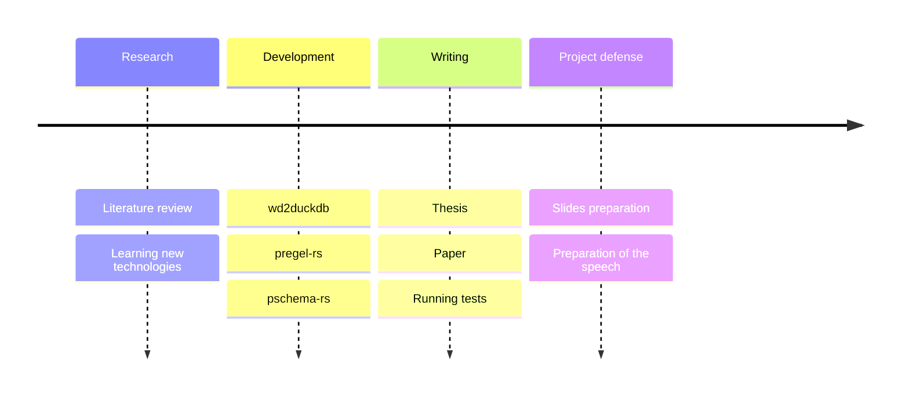

<div>
<a href="https://angelip2303.github.io" class="font-300">Ángel Iglesias Préstamo</a>
</div>

<div>
  	<h1 class="font-extrabold">PSchema</h1>
  	<p class="font-300">
      Analysis and implementation of an algorithm to validate Knowledge Graphs using Big data techniques
    </p>
</div>

<Pagination classNames="text-gray-300" />

---

# 🗂️ Table of contents

- [Introduction](#introduction)

---

# 🐿️ The project in a nutshell



---
layout: center
---

# 🌉 Motivation

- ✔ Knowledge Graphs are a **powerful tool** to represent knowledge.
- ✔ They are **flexible** and **extensible**.
- ✔ They are **easy to understand** by humans.
- ✔ They are used in **many fields**.
- ❌ They are **hard to be validated** by machines.
- ❌ They tend to be **huge**.

---
layout: two-cols-content-bottom
---

# 👨‍🏫 How do we represent Knowledge?

::content::

- _Knowledge_ is at the highest level of abstraction, while _Data_ is at the lowest.
- We want to represent _Knowledge_ using _Data_. **How do we do that?**

::left::

## 📄 RDF

- **R**esource **D**escription **F**ramework.
- W3C Recommendation.
- Standard for knowledge representation.
- Based on triples.
- Uses URIs to identify resources.

::right::

## 🕶️ Opaque URIs

- A URI is a unique sequence of characters that **identifies** a resource, namely, _subjects_, _predicates_ and _objects_.
- Designing good URIs is the **first step** in linked data development.

::bottom::

```turtle
# i.e. Alan Turing is a Human
# N-Triples: subject predicate object .
<http://example.org/alan> <http://example.org/instanceOf> <http://example.org/Human> . # descriptive
<http://example.org/Q7251> <http://example.org/P31> <http://example.org/Q5> . # opaque
```

---

# 🧠 Knowledge Graphs

<figure>
    
    <figcaption> <span> Figure 1: </span> Knowledge Graph modelling some information about Alan Turing </figcaption>
</figure>

---

# 🤓 How do we address that issue?

<figure>
    
    <figcaption> <span> Figure 2: </span> ShEx-based <it> subset </it> generation process for Alan Turing's example </figcaption>
</figure>

---
layout: center
---

# 🌐 Wikidata

- ✔ Is a **free** and **open** Knowledge Graph.
- ✔ Supports **multiple languages**, thanks to _opaque URIs_.
- ✔ Supports **Shape Expressions** since 2019.
- ❌ Is **huge**<sup>1</sup>.
- ❌ Is **hard to validate**, due to its size.
- ❌ Data comes from **multiple sources**.

<Footnotes separator>
    <Footnote :number=1>
    Wikidata contains more than <a href="https://www.wikidata.org/wiki/Wikidata:Statistics"> 100 million items</a>. The dump file is 100 GB compressed, and 1.5 TB uncompressed.
    </Footnote>
</Footnotes>

---
layout: center
---

# Big Data

- 📈 Volume
- 🚄 Velocity
- 🌪️ Variety

---
layout: diagram
---

<h1> 👨‍💻 Pregel<sup>1</sup> </h1>

- Graph processing framework.
- Developed by Google.
- Based on Bulk Synchronous Parallel model.
- Uses message passing.
- Distributed.
- _Thinking like a vertex_.

<div class="flex flex-row gap-4">
    <figure>
        
        <figcaption> <span> Figure 1: </span> Abstract representation of the Königsberg bridges problem </figcaption>
    </figure>
    <figure>
        
        <figcaption> <span> Figure 2: </span> Graph representation of the problem  </figcaption>
    </figure>
</div>

<Footnotes separator>
    <Footnote :number=1>
    Pregel as implemented in <a href="https://github.com/angelip2303/pregel-rs"> pregel-rs </a>
    </Footnote>
</Footnotes>

::right::

<figure>
    
    <figcaption> <span> Figure 3: </span> Pregel model </figcaption>
</figure>

---
layout: quote
---

## "Do not communicate by sharing memory; instead, share memory by communicating."
[Effective Go](https://go.dev/doc/effective_go#concurrency)

---

# 🧮 PSchema

- **P**regel-based **Schema** validation algorithm.
- Validates Knowledge Graphs.
- Uses Pregel to distribute the validation process.
- Uses Shape Expressions to define the schema.
- Can use different Knowledge Graphs as input.
- Based on a multithreaded implementation of Pregel.

---
layout: diagram-header
---

# 🌳 How are Shape Expressions represented?

::left::

```turtle
:Person {
	:placeOfBirth @:Place ;
	:dateOfBirth @:Date ;
	:employer @:Organization ;
}
:Place {
	:country @:Country
}
:Country {}
:Organization {}
:Date {}
```

## 🌳 Shape Expression tree

::right::

<figure>
    
    <figcaption> <span> Figure 4: </span> Shape Expression tree </figcaption>
</figure>

---
layout: diagram-header
---

# 🚶 _Reverse_ Level order traversal

::left::

- **Level order traversal** visits the nodes of a tree level by level.
- **Reverse** level order traversal visits the nodes of a tree level by level, but in reverse order.

## Iterator

<Footnotes separator>
    <Footnote :number=1>
    <it> Reverse </it> level order traversal as implemented in <a href="https://github.com/angelip2303/pschema-rs"> pschema-rs </a>
    </Footnote>
</Footnotes>

::right::

<figure>
    
    <figcaption> <span> Order: </span> h, i, j, k, d, e, f, g, b, c, a  </figcaption>
</figure>

---
layout: full
---


---

# 0️⃣ The algorithm in action

<figure>
    
    <figcaption> <span> Figure 6: </span> The Initial Messages are sent to all the nodes in the graph </figcaption>
</figure>

---
layout: big-diagram
---

# 1️⃣ The algorithm in action

::big::


::small::


::bottom::

<Footnotes separator>
    <Footnote :number=1>
        For simplicity, only the nodes that are valid are highlighted. However, all the nodes will send messages to their neighbors in the <it> destination </it> to <it> source </it> direction.
    </Footnote>
</Footnotes>

---
layout: big-diagram
---

# 1️⃣ The algorithm in action

::big::


::small::


---
layout: big-diagram
---

# 1️⃣ The algorithm in action

::big::


::small::


---
layout: big-diagram
---

# 2️⃣ The algorithm in action

::big::


::small::


---
layout: big-diagram
---

# 2️⃣ The algorithm in action

::big::


::small::


---
layout: big-diagram
---

# 2️⃣ The algorithm in action

::big::


::small::


---
layout: big-diagram
---

# 3️⃣ The algorithm in action

::big::


::small::


::bottom::

<Footnotes separator>
    <Footnote :number=1>
        In the actual implementation, the message is sent by the <it> first </it> node in the DataFrame.
    </Footnote>
</Footnotes>

---
layout: big-diagram
---

# 3️⃣ The algorithm in action

::big::


::small::


---
layout: big-diagram
---

# 3️⃣ The algorithm in action

::big::


::small::


---

# 🏁 Resulting _subgraph_


---
layout: two-cols-bottom
---

# 🗃️ How is the dataset stored?

::left::

<h2> 📦 Row-oriented </h2>

::right::

<h2> 📦 Column-oriented<sup>1</sup> </h2>

This allows us to implement some **optimizations**...

::bottom::

<Footnotes separator>
    <Footnote :number=1>
    <it> Reverse </it> level order traversal as implemented in <a href="https://github.com/angelip2303/pschema-rs"> pschema-rs </a>
    </Footnote>
</Footnotes>

---
layout: section
---

# 🚀 Optimizations

---
layout: two-cols-bottom
---

# 🔁 Move-to-Front Coding

::left::

The **Move-to-Front Coding** is a **lossless** _transformation algorithm_ which processes a sequence of symbols and produces a sequence of integers.

The **idea** is that the most recently used symbols are more likely to be used again in the near future. Hence, we can maintain a list of the symbols and when one is used, it is moved to the front of the list.

1. This allows us to **exploit the locality** of the data.
2. The **most frequent** items will require **fewer bits**.
3. **Cache** misses are **less likely** to happen.

<style>
ol {
  list-style: none; /* Remove list bullets */
  padding: 0;
  margin: 0;
}

ol li {
  padding-left: 1rem;
  text-indent: -0.75rem;
}

ol li::before {
  content: "😲 ";
}

ol li:nth-child(2)::before {
  content: '🤏 ';
}

ol li:nth-child(3)::before {
  content: '😎 ';
}
</style>

::right::

#### i.e Encoding<sup>1</sup> the string _panama_

| **input** |  **output**  | **list**                   |
|-----------|--------------|----------------------------|
| p         | 15           | abcdefghijklmnopqrstuvwxyz |
| a         | 15 1         | pabcdefghijklmnoqrstuvwxyz |
| n         | 15 1 14      | apbcdefghijklmnoqrstuvwxyz |
| a         | 15 1 14 1    | napbcdefghijklmoqrstuvwxyz |
| m         | 15 1 14 1 14 | anpbcdefghijklmoqrstuvwxyz |
| a         | 15 1 14 1 14 | manpbcdefghijkloqrstuvwxyz |

<style>
h4 {
    margin-left: 1em;
}
table {
    margin-left: 1em;
}
</style>

::bottom::

<Footnotes separator>
    <Footnote :number=1>
        <a href="https://www.geeksforgeeks.org/move-front-data-transform-algorithm/"> https://www.geeksforgeeks.org/move-front-data-transform-algorithm/ </a>
    </Footnote>
</Footnotes>

<style>
li::before {
  content: "";
}
</style>

---

# 💾 Caching

---

# 🔬 Theorem

---
layout: section
---

# 📢 Diffusion

---

# 📊 Results

---
layout: iframe-right
url: https://biohackrxiv.org/md73k
---

# 🧬 BioHackathon 2023


---

# 📚 References

---
layout: end
---

---
layout: cover
---

<figure>
    
    <figcaption> <span> Figure 1: </span> Time spent in each phase of the project </figcaption>
</figure>

---

# Other examples of Knowledge Graphs

---

# Supported Shape Expression features