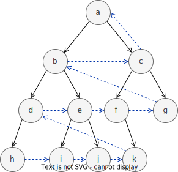

<div>
<a href="https://angelip2303.github.io" class="font-300">Ángel Iglesias Préstamo</a>
</div>

<div>
  	<h1 class="font-extrabold">PSchema</h1>
  	<p class="font-300">
      Analysis and implementation of an algorithm to validate Knowledge Graphs using Big data techniques
    </p>
</div>

<Pagination classNames="text-gray-300" />

---

# 🗂️ Table of contents

- [Introduction](#introduction)

---

# 🐿️ The project in a nutshell


---
layout: center
---

# 🌉 Motivation

- ✔ Knowledge Graphs are a **powerful tool** to represent knowledge.
- ✔ They are **flexible** and **extensible**.
- ✔ They are **easy to understand** by humans.
- ✔ They are used in **many fields**.
- ❌ They are **hard to validate** by machines.
- ❌ They tend to be **huge**.

---
layout: two-cols-bottom
---

# 👨‍🏫 How do we represent Knowledge?

::content::

- _Knowledge_ is at the highest level of abstraction, while _Data_ is at the lowest.
- We want to represent _Knowledge_ using _Data_. **How do we do that?**

::left::

## 📄 RDF

- **R**esource **D**escription **F**ramework.
- W3C Recommendation.
- Standard for knowledge representation.
- Based on triples.
- Uses URIs to identify resources.

::right::

## 🕶️ Opaque URIs

- A URI is a unique sequence of characters that **identifies** a resource, namely, _subjects_, _predicates_ and _objects_.
- Designing good URIs is the **first step** in linked data development. As such, there are two main types of URIs: _descriptive_ and _opaque_.

::bottom::

```turtle
# i.e. Alan Turing is a Human
# N-Triples: subject predicate object .
<http://example.org/alan> <http://example.org/instanceOf> <http://example.org/Human> . # descriptive
<http://example.org/Q7251> <http://example.org/P31> <http://example.org/Q5> . # opaque
```

---

# 🧠 Knowledge Graphs

<center>

</center>

---

# 🤓 How do we address that issue?


---
layout: center
---

# Big Data

- 📈 Volume
- 🚄 Velocity
- 🌪️ Variety

---

# 🌐 Wikidata


---
layout: diagram
---

<h1> 👨‍💻 Pregel<sup>1</sup> </h1>

- Graph processing framework.
- Developed by Google.
- Based on Bulk Synchronous Parallel model.
- Uses message passing.
- Distributed.
- _Thinking like a vertex_.

<div class="flex flex-row gap-4 mt-2">
<figure>
    
    <figcaption> <span> Figure 1: </span> Abstract representation of the Königsberg bridges problem </figcaption>
</figure>

<figure>
    
    <figcaption> <span> Figure 2: </span> Graph representation of the problem  </figcaption>
</figure>
</div>

<Footnotes separator>
    <Footnote :number=1>
    Pregel as implemented in <a href="https://github.com/angelip2303/pregel-rs"> pregel-rs </a>
    </Footnote>
</Footnotes>

::right::


---
layout: quote
---

## "Do not communicate by sharing memory; instead, share memory by communicating."
[Effective Go](https://go.dev/doc/effective_go#concurrency)

---

# 🧮 PSchema

- **P**regel-based **Schema** validation algorithm
- Validates Knowledge Graphs
- Uses Pregel to distribute the validation process

---
layout: diagram
---

# 🌳 Shape Expression tree

```turtle
:Person {
	:placeOfBirth @:Place ;
	:dateOfBirth @:Date ;
	:employer @:Organization ;
}
:Place {
	:country @:Country
}
:Country {}
:Organization {}
:Date {}
```

::right::


---
layout: diagram-header
---

# 🚶 _Reverse_ Level order traversal

::left::

- **Level order traversal** visits the nodes of a tree level by level.
- **Reverse** level order traversal visits the nodes of a tree level by level, but in reverse order.


<Footnotes separator>
    <Footnote :number=1>
    <it> Reverse </it> level order traversal as implemented in <a href="https://github.com/angelip2303/pschema-rs"> pschema-rs </a>
    </Footnote>
</Footnotes>

::right::

<figure>
    
    <figcaption> <span> Order: </span> h, i, j, k, d, e, f, g, b, c, a  </figcaption>
</figure>

---
layout: full
---


---
layout: big-diagram
---

# 0️⃣ The algorithm in action

::big::

## Knowledge Graph


::small::

## Shape Expression tree


---
layout: big-diagram
---

# 1️⃣ The algorithm in action

::big::

## Knowledge Graph


::small::

## Shape Expression tree


---
layout: big-diagram
---

# 2️⃣ The algorithm in action

::big::

## Knowledge Graph


::small::

## Shape Expression tree


---
layout: big-diagram
---

# 3️⃣ The algorithm in action

::big::

## Knowledge Graph


::small::

## Shape Expression tree


---

# 🏁 Resulting _subgraph_

<center>

</center>


---
layout: two-cols-header
---

# 🗃️ How is the dataset stored?

::left::

<h2> 📦 Row-oriented </h2>

::right::

<h2> 📦 Column-oriented<sup>1</sup> </h2>

<Footnotes separator>
    <Footnote :number=1>
    <it> Reverse </it> level order traversal as implemented in <a href="https://github.com/angelip2303/pschema-rs"> pschema-rs </a>
    </Footnote>
</Footnotes>

---
layout: section
---

# 🚀 Optimizations

---

# 🔁 Move-to-Front Coding

(Witten, I. H., A. Moff at, and T. C. Bell (1999). Managing Gigabytes : Compressing and Indexing Documents and Images. Morgan Kaufmann.)

---

# 💾 Caching

---

# 🔬 Theorem

---
layout: section
---

# 📢 Diffusion

---

# 📊 Results

---
layout: iframe-right
url: https://biohackrxiv.org/md73k
---

# 🧬 BioHackathon 2023
